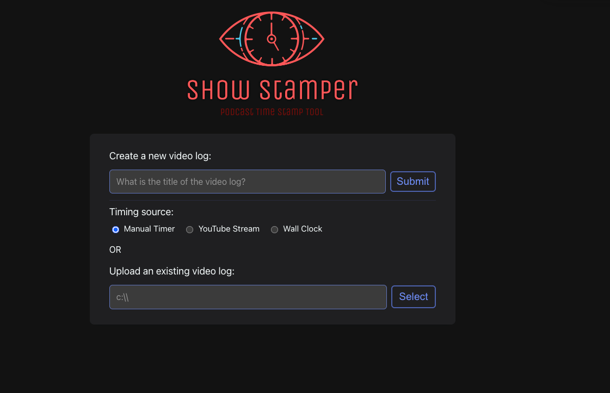
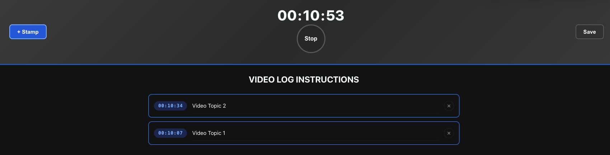
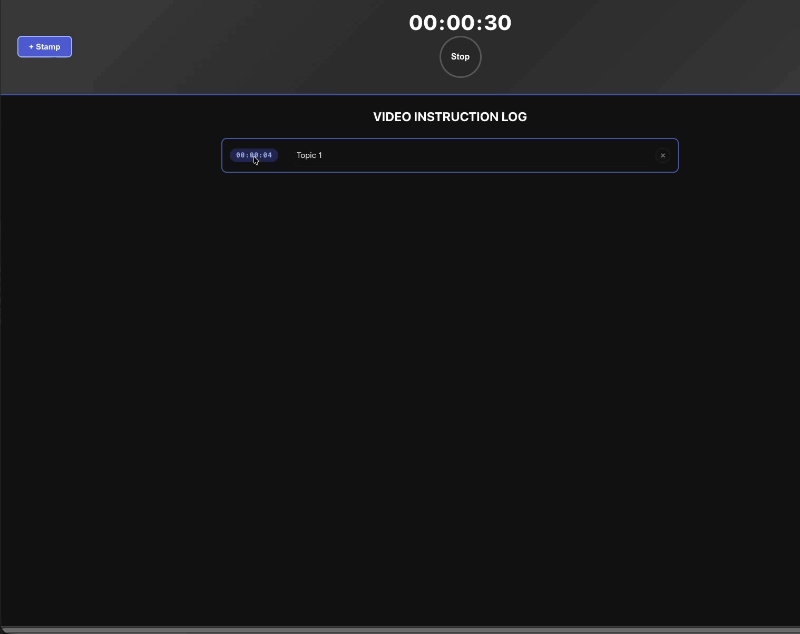
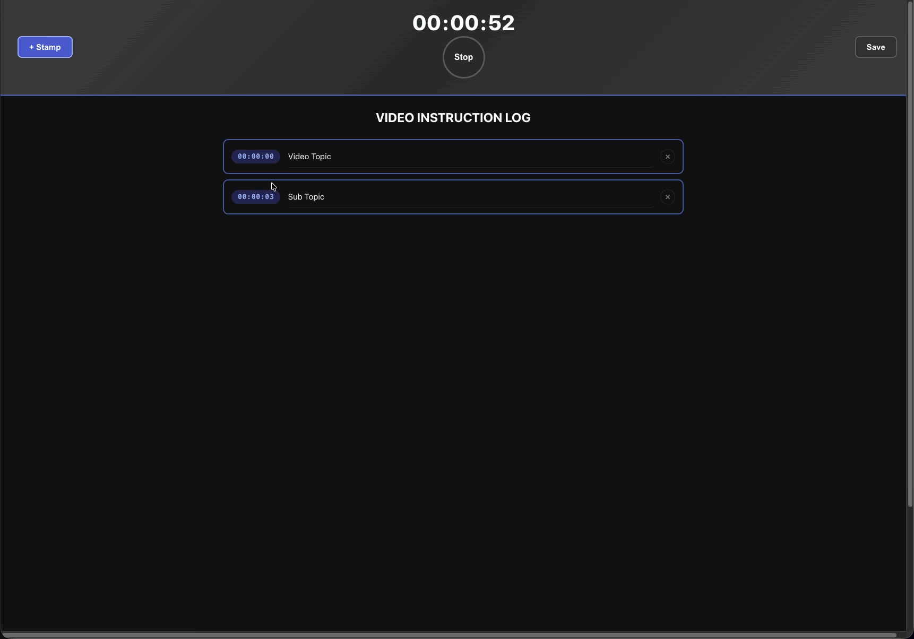

# Show Stamper

A web application for creating detailed timestamped video logs with hierarchical topics.

## Features

- **Three timing modes** — Manual Timer, YouTube Stream (synced to an embedded player), or Wall Clock (real system time)
- Create timestamps with topics at any point during playback or recording
- **Inline time editing** — stop the timer, click the time display to edit it, press Enter to resume
- **Sorted insertion** — new timestamp cards are inserted in chronological order automatically
- Organize timestamps into hierarchies via drag-and-drop nesting and extraction
- Add multiple time marks to a single topic (double-click the time badge); up to two per row
- Save/load timestamp logs as files

### Launch screen

### Timestamp log

### Adding extra times to a card

### Drag-and-drop nesting

## Usage

1. Open the app in a browser.
2. Enter a title for your log, or upload an existing file.
3. Choose a timing source:
   - **Manual Timer** — a built-in stopwatch you control with the Start/Stop button.
   - **YouTube Stream** — paste a YouTube URL; the timer follows the embedded player.
   - **Wall Clock** — the timer tracks real elapsed time from when you press Start.
4. Press **Start** (the circular button in the banner).
5. Press **+ Stamp** to capture the current time as a new timestamp card.
6. Type a topic into the card's text field.
7. Double-click a time badge to append a second time mark to the same card.
8. Drag a card onto another card to nest it as a subtopic; click the extract icon to pop it back up.
9. Press **Stop** at any time — click the time display to edit the value, then press Enter to confirm.
10. Press **Save** to download your log as a file.

## Development

- `public/index.html` — Main entry point; timing-mode selector, title form
- `public/javascript/java.js` — App logic: timer control, stamp management, drag-and-drop, file I/O
- `public/javascript/ui.js` — Dynamic UI: banner, timestamp cards, sorted insertion
- `public/javascript/timeSource.js` — `Timer`, `WallClockTimer`, and `YouTubeTimeSource` classes
- `public/javascript/TimeStamp.js` — `Timestamp` data model
- `public/javascript/stampManager.js` — Stamp map CRUD and file serialization
- `public/javascript/domUtils.js` — DOM traversal helpers
- `public/javascript/FileSaver.js` — File saving utility

## Testing

Run `npm test` to execute unit tests (requires Node.js).

## Deployment

Hosted on Firebase. Use `firebase deploy` to update.
