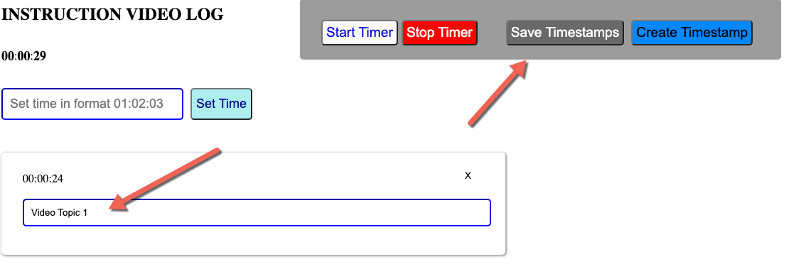
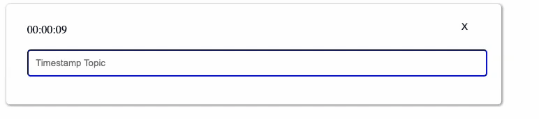

# Show Stamper

A web application for creating detailed timestamped video logs with hierarchical topics.

## Features

- Start/stop timer synced with video playback
- Create timestamps with topics at specific times
- Organize timestamps into hierarchies via drag-and-drop
- Save/load timestamp logs as files
- Manual time adjustment

## Usage

1. Open `index.html` in a browser.
2. Enter a title for your video log or upload an existing file.
3. Start the timer and create timestamps as needed.
4. Drag timestamps to nest them under others.
5. Save your log when done.

## Development

- `public/index.html`: Main entry point
- `public/javascript/TimeStamp.js`: Data model for timestamps
- `public/javascript/java.js`: UI and logic
- `public/javascript/FileSaver.js`: File saving utility
## Screenshots

### Overview

### Double Click to Add Time

## Testing

Run `npm test` to execute unit tests (requires Node.js and Jest).

## Deployment

Hosted on Firebase. Use `firebase deploy` to update.
